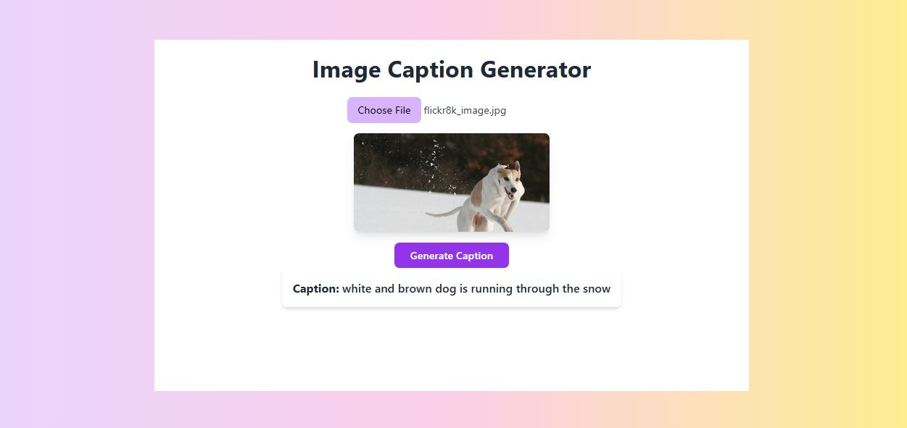

# Image Captioning – CNN-LSTM Model

Image Captioning is a deep learning-based web application that generates natural language descriptions for images. It uses a CNN (for feature extraction) and LSTM (for sequence modeling) architecture to generate accurate captions.

